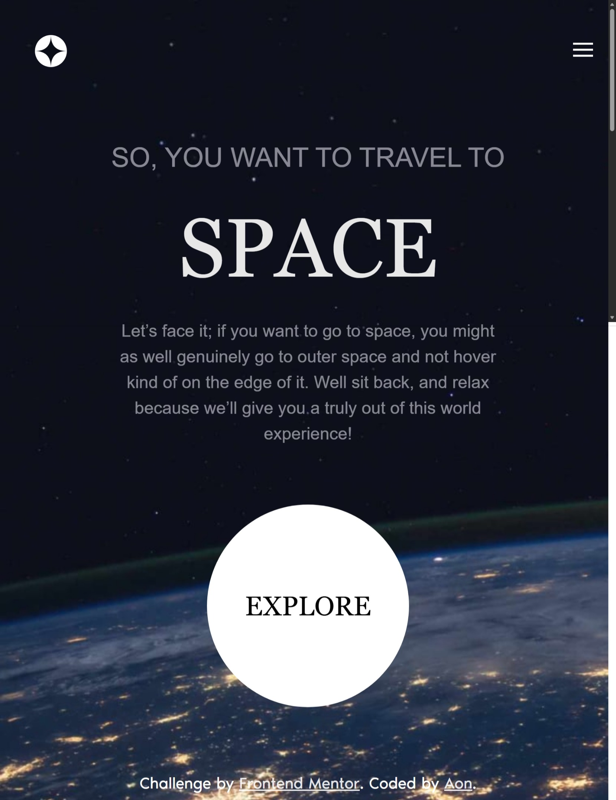
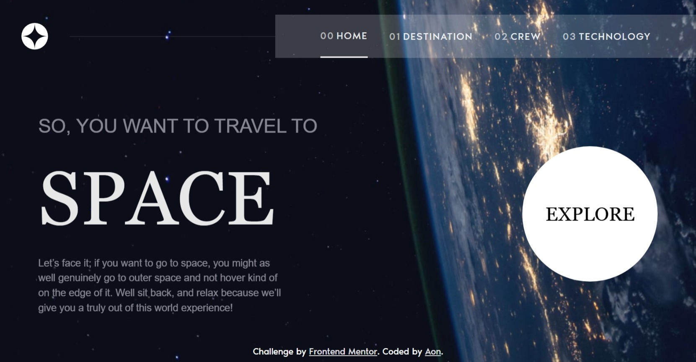
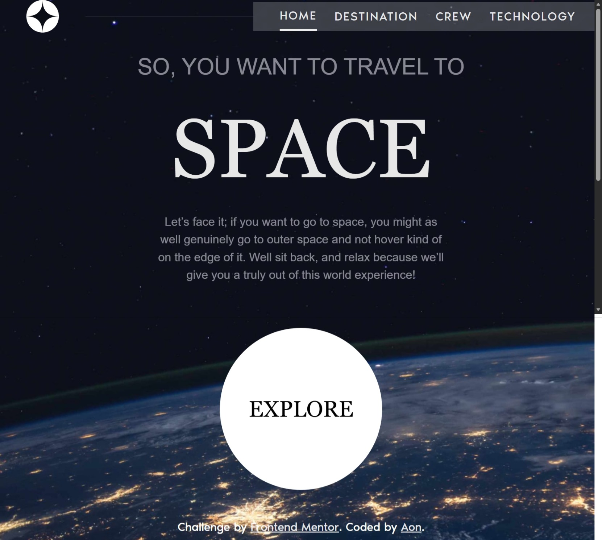

# Frontend Mentor - Space tourism website solution

This is a solution to the [Space tourism website challenge on Frontend Mentor](https://www.frontendmentor.io/challenges/space-tourism-multipage-website-gRWj1URZ3). Frontend Mentor challenges help you improve your coding skills by building realistic projects. 

## Table of contents

- [Frontend Mentor - Space tourism website solution](#frontend-mentor---space-tourism-website-solution)
  - [Table of contents](#table-of-contents)
  - [Overview](#overview)
    - [The challenge](#the-challenge)
  - [Screenshot](#screenshot)
    - [Links](#links)
  - [My process](#my-process)
    - [Built with](#built-with)
  - [Author](#author)

## Overview

### The challenge

Users should be able to:

- View the optimal layout for each of the website's pages depending on their device's screen size
- See hover states for all interactive elements on the page
- View each page and be able to toggle between the tabs to see new information

## Screenshot

  <figure style="margin: 0; height: 300px; text-align: center; width: 40%;">
    <figcaption>Mobile preview</figcaption>
    
  </figure>

  

    <figure style="margin: 0; width: 100%; text-align: center;">
      <figcaption>Tablet preview</figcaption>
      
    </figure>
    <figure style="margin: 0; width: 100%; text-align: center;">
      <figcaption>Desktop preview</figcaption>
      
    </figure>
  

### Links

- [Solution URL](https://github.com/Aon-m/space-tourism-website-main/)
- [Live Server URL](https://aon-m.github.io/space-tourism-website-main/)

## My process

### Built with

- Semantic HTML5 markup
- CSS custom properties
- Flexbox
- CSS Grid
- Mobile-first workflow
- Personal Library
- SCSS
- BEM
- Modular JS

## Author

- Frontend Mentor - [@Aon](https://www.frontendmentor.io/profile/Aon-m)
- CSSBattle - [@Aon](https://cssbattle.dev/player/aon)
- Github - [@Aon-m](https://github.com/Aon-m)
